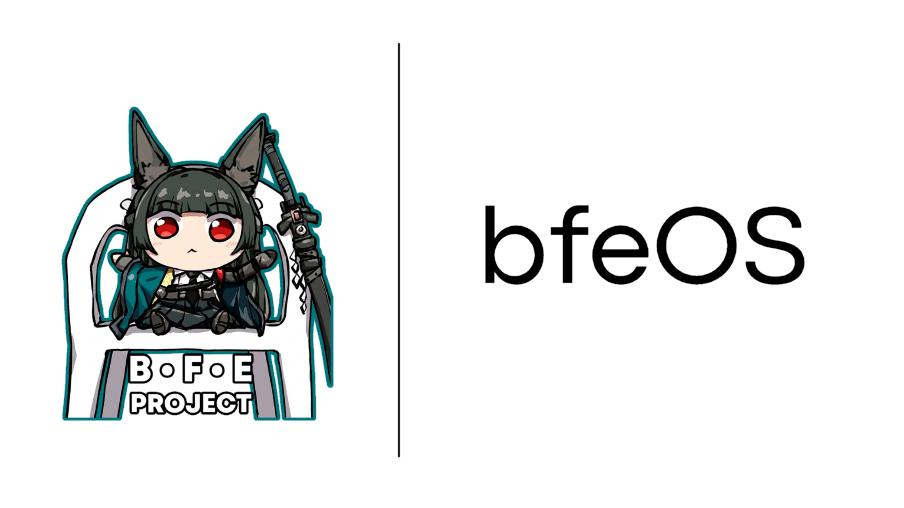

  

<h1 align="center">bfeOS — Windows Limpio, Privado y Listo para Usar</h1>

**bfeOS** es una versión optimizada de Windows diseñada para ofrecer el máximo rendimiento, eliminar el bloatware innecesario, proteger tu privacidad y proporcionar una experiencia limpia y lista para usar desde el primer inicio.

---

## 🌟 Características Principales

- 🚀 **Alto Rendimiento:** Eliminación de procesos en segundo plano y servicios innecesarios de Windows.
- 🛡️ **Privacidad Mejorada:** Telemetría, rastreadores y servicios de recolección de datos desactivados por defecto.
- 🧹 **Sin Bloatware:** Libre de aplicaciones preinstaladas molestas (Cortana, Candy Crush, widgets publicitarios, etc.).
- 📦 **Listo para Usar:** Incluye configuraciones básicas listas para trabajar, jugar o transmitir sin perder tiempo configurando.
- 💻 **Bajo Consumo de RAM y CPU:** Ideal para aprovechar al máximo el hardware de tu equipo.

---

## 🛠️ Modificaciones y Ajustes (Tweaks)

| Categoría | Cambios aplicados |
| :--- | :--- |
| **Privacidad** | Desactivación de Telemetría, Bing Search en el menú inicio, Keylogger de Windows y Diagnósticos. |
| **Rendimiento** | Optimización de plan de energía, reducción de latencia del sistema y servicios innecesarios detenidos. |
| **Interfaz** | Menú contextual limpio, explorador de archivos ágil y sin distracciones. |

---

## 📥 Descarga e Instalación

> ⚠️ **Nota:** Se recomienda realizar una copia de seguridad de tus archivos importantes antes de proceder con la instalación.

### 1. Descargar la Imagen ISO de bfeOS
Puedes descargar la versión más reciente o la que deseas instalar en la sección de [Releases](../../releases).

### 2. Crear un USB Booteable
Para grabar la ISO en un pendrive, recomendamos usar **Rufus**:
- [Descargar Rufus](https://rufus.ie/)
- Formato recomendado: **GPT / UEFI** o **MBR / Legacy** según tu tarjeta madre (Recomendamos usar GPT UEFI).

### 3. Instalación
1. Conecta el USB a tu PC y reinicia ingresando al menú de arranque (Boot Menu).
2. Selecciona la unidad USB y sigue las instrucciones en pantalla.
3. Al finalizar, el sistema se reiniciará con **bfeOS** completamente configurado.

---

## ❤️ Donaciones

bfeOS es un proyecto sin fines de lucro, mas sin embargo tu apoyo nos motiva a seguir dando soporte al sistema. Puedes apoyar directamente al creador de la comunidad CardinalOnix comprando tu sub en su canal de [Twitch](https://twitch.tv/CardinalOnix) o dejando tu mejora en nuestro [servidor de Discord](https://discord.com/invite/XK6F8g6CaP) dentro del cual podrás comentarnos sobre errores que pasan en tu instalación de bfeOS.

---

